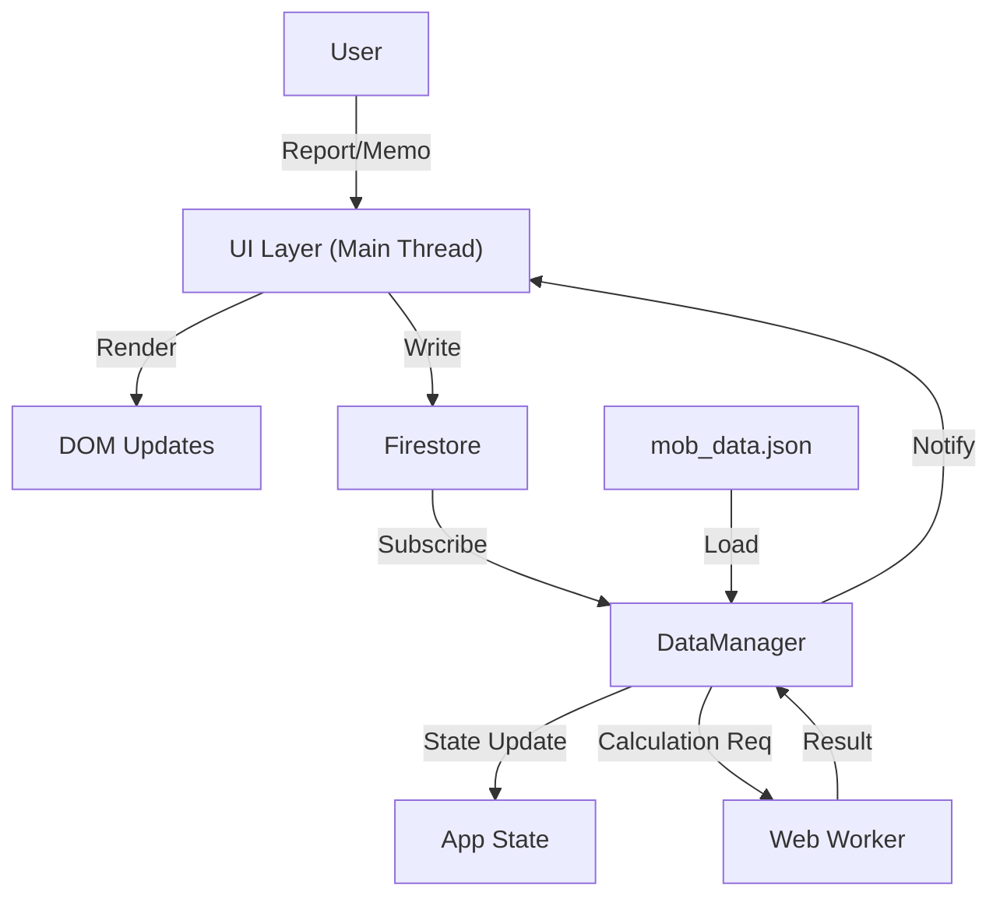

# The Hunt System Specification

本ドキュメントは、FFXIVモブハント管理アプリケーション「The Hunt」の完全な技術仕様書である。
本仕様書を参照することで、開発者はシステムを一から再構築することが可能となる。

---

## 1. システム概要とアーキテクチャ

### 1.1 目的

FFXIVのS/A/Fランクモブの湧き時間をリアルタイムで管理・共有し、高度な湧き予測計算を提供する単方向データフローアプリケーション。

### 1.2 技術スタック

- **Frontend**: HTML5, Vanilla JavaScript (ES2022 Modules), Web Workers
- **Styling**: CSS3 (Vanilla + Tailwind CSS utilities), CSS Variables
- **Backend / Realtime**: Firebase (Firestore, Authentication)
- **Asset / Data**: JSON (Static Data), WebP (Images)
- **Third Party**: Marked.js (Markdown Rendering), Google Fonts (Inter, Outfit)

### 1.3 アーキテクチャ概略

メインスレッド（UI/Event）とワーカースレッド（計算）を分離し、Firestoreによるリアルタイム同期を行う。



---

## 2. データ構造詳細

### 2.1 静的データ (`mob_data.json`)

アプリケーションの基盤となるマスターデータ。`mobs` オブジェクトのキーはモブID。

**Schema Definition:**

| Key | Type | Description |
| --- | --- | --- |
| `rank` | String | ランク ("S", "A", "F") |
| `name` | String | モブ名称 |
| `area` | String | 出現エリア名 |
| `condition` | String | 湧き条件のテキスト記述（表示用） |
| `repopSeconds` | Number | 最短リポップ時間（秒） |
| `maxRepopSeconds` | Number | 最長リポップ時間（秒） |
| `mapImage` | String | マップ画像ファイル名 |
| `moonPhase` | String? | "満月" / "新月" (特定月齢条件) |
| `weatherSeedRange` | [Number, Number]? | 天候シード範囲 [min, max] (0-99) |
| `timeRange` | {start: Number, end: Number}? | ET湧き時間条件 |
| `weatherDuration` | {minutes: Number}? | 天候継続時間の要件 |
| `locations` | PointObject[] | 湧き候補地点リスト |

**PointObject Structure:**

```json
{
  "id": "UN_101", // ユニークID (AreaInitial_Number)
  "x": 33.5,     // X座標 (%)
  "y": 8.0,      // Y座標 (%)
  "mob_ranks": ["S", "A", "B1"] // この地点で湧くモブのランク/優先度
}
```

### 2.2 状態管理 (`dataManager.js`)

シングルトンパターンの `state` オブジェクトによりメモリ内で状態を保持。

#### 2.2.1 Global State Object

```javascript
const state = {
    userId: String | null,          // 匿名認証UID
    baseMobData: Array<MasterMob>,  // processMobData済みマスターデータ
    mobs: Array<RuntimeMob>,        // UI描画用データ配列
    mobLocations: Object,           // 湧き潰し状態マップ { [mobNo]: { un_101: { culled_at: TS, ... } } }
    maintenance: {                  // メンテナンス情報
        start: String(ISO),
        end: String(ISO),
        message: String
    } | null,
    initialLoadComplete: Boolean,   // 初回ロード完了フラグ
    worker: Worker,                 // 計算用Web Workerインスタンス
    filter: FilterState,            // (See 5.4 LocalStorage)
    pendingCalculationMobs: Set     // 計算待ちモブID
};
```

#### 2.2.2 Runtime Mob Object Structure (`state.mobs[i]`)

マスターデータ、サーバーデータ、計算結果が統合されたオブジェクト。

```javascript
{
    ...MasterMob, // (See 2.1)

    // Server Synced Data
    last_kill_time: Number (UnixTimestamp ms) | 0,
    memo_text: String | "",
    memo_updated_at: Number (UnixTimestamp ms) | 0,

    // Calculated Properties (Updated by Worker/cal.js)
    repopInfo: {
        status: "MaxOver" | "ConditionActive" | "PopWindow" | "NextCondition" | "Next",
        elapsedPercent: Number,       // 0.0 - 100.0 (プログレスバー用)
        minRepop: Number (UnixTimestamp sec),
        maxRepop: Number (UnixTimestamp sec),
        timeRemaining: String,        // 表示用テキスト (e.g. "あと 10:00" / "未確定")
        
        isInConditionWindow: Boolean, // 現在時刻が特殊条件合致期間内か
        conditionRemaining: String?,  // 条件期間の残り時間テキスト
        nextConditionSpawnDate: Date?,// 次回条件合致開始日時
        
        isMaintenanceStop: Boolean,     // メンテにより停止中
        isBlockedByMaintenance: Boolean // メンテ時間と被るため湧き不可
    }
}
```

---

## 3. Firestore データベース設計

### 3.1 コレクション構成

| Collection | Document ID | Description |
| --- | --- | --- |
| `mob_status` | `s_latest` | Sランク全モブの最新討伐情報 |
| `mob_status` | `a_latest` | Aランク全モブの最新討伐情報 |
| `mob_status` | `f_latest` | Fランク全モブの最新討伐情報 |
| `mob_locations` | `{MobID}` | 各モブの湧き潰しポイント情報 |
| `shared_data` | `memo` | 全モブの共有メモ |
| `shared_data` | `maintenance` | メンテナンス情報 |

### 3.2 データモデル詳細

#### `mob_status/{rank_latest}`

単一ドキュメント内に複数モブの情報をMapとして保持（Read回数削減のため）。

```json
{
  "11011": {
    "last_kill_time": Timestamp, // 最終討伐時刻
    "prev_kill_time": Timestamp  // 前々回討伐時刻 (履歴用)
  },
  "12011": { ... }
}
```

#### `mob_locations/{MobID}`

特定モブの湧き地点ごとのステータス。

```json
{
  "points": {
    "UN_101": {
      "culled_at": Timestamp,   // 湧き潰し時刻
      "uncull_at": Timestamp    // 湧き潰し解除時刻
    }
  }
}
```

**注意**: `server.js` の `normalizePoints` 関数により、ドット記法 (`points.UN_101.culled_at`) の更新差分も適切にオブジェクトへ展開される。

#### `shared_data/memo`

直近のメモのみを配列で保持（現在は実質最新1件運用）。

```json
{
  "11011": [
    {
      "memo_text": "String",
      "created_at": Timestamp
    }
  ]
}
```

---

## 4. アルゴリズム仕様

### 4.1 時間・リポップ計算 (`cal.js`)

**基本計算式**:

```javascript
minRepop = lastKill + repopSeconds; // 最短湧き時刻
maxRepop = lastKill + maxRepopSeconds; // 最長湧き時刻
```

**メンテナンス補正ロジック**:
メンテナンス明け時刻 (`serverUp`) が `lastKill` より後の場合、タイマーがリセットされる。

- **S/Aランク**: `minRepop = serverUp + (repopSeconds * 0.6)`
- **Fランク**: `minRepop = serverUp + repopSeconds` （短縮なし）

### 4.2 特殊条件判定と予測探索 (`findNextSpawn`)

以下のエオルゼア時間(ET)・環境条件を組み合わせ、**最短湧き時刻以降**に条件を満たす最初のウィンドウを計算する。

1. **Moon Phase (月齢)**: ET 32日周期。
    - `calculateNextMoonStart` で次回の対象月齢開始時間を算出。
2. **Weather (天候)**: ET 8時間 (地球時間23分20秒) 周期。
    - `getEorzeaWeatherSeed` で算出される `0-99` のシード値が `weatherSeedRange` に含まれるか判定。
    - `checkWeatherInRange` 関数を使用。
3. **Time Range (ET時間)**: ET 1日 (地球時間70分) 周期。
    - 現在のETが指定範囲内か `checkTimeRange` で判定。

これらの条件は非常に重いため、`worker.js` でメインスレッドをブロックせずに総当たり探索 (`getValidWeatherIntervals` Generatorなど) を行う。

### 4.3 ステータス判定フロー

各モブは計算結果に基づき以下のステータスを持つ。

1. `MaxOver`: `now >= maxRepop` （確定湧き）
2. `ConditionActive`: 特殊条件を満たすウィンドウ収集中
3. `NextCondition`: 次の条件合致まで待機中
4. `PopWindow`: `now >= minRepop` （抽選湧き期間中）
5. `Next`: `now < minRepop` （湧き待ち）

これらは `calculateRepop` 関数内で一括判定され、UIのプログレスバー色やソート順に反映される。

---

## 5. クライアントサイド実装仕様

### 5.1 DOM構成とコンポーネント定義 (`uiRender.js`)

#### 5.1.1 Mob Card Component

`createMobCard` 関数によって生成されるDOMの厳密な構造。

```html
<div class="mob-card rounded-lg shadow-xl cursor-pointer"
     data-mob-no="{Mob.No}"
     data-rank="{Mob.Rank}"
     data-last-status="{Status}"
     data-last-in-condition="{Boolean}">
    
    <!-- Header Section -->
    <div class="mob-card-header" data-toggle="card-header">
        <div class="content-area">
            <!-- Row 1: Basic Info -->
            <div class="flex items-center justify-between">
                <div class="flex items-center">
                    <span class="mob-name" style="color: var(--rank-{rank})">{Name}</span>
                    <span class="mob-count-container">@{Count}</span>
                    <span class="memo-icon-container">📝</span>
                </div>
                <div class="area-info-container">
                    <!-- Area Name & Expansion/Rank Badges -->
                </div>
            </div>
            
            <!-- Row 2: Progress Bar -->
            <div class="progress-bar-wrapper">
                <div class="progress-bar-bg {P0_60|P60_80|P80_100|MAX_OVER}" style="width: {percent}%"></div>
                <div class="progress-text {TEXT_NEXT|TEXT_POP}">
                    <!-- Left: Time/Percent, Right: Repop/Date -->
                </div>
            </div>
        </div>

        <!-- Sidebar: Report Button -->
        <div class="report-side-bar {rank-s|rank-a|rank-f}" 
             data-report-type="{modal|instant}" 
             data-mob-no="{Mob.No}">
             <!-- CSS based report icon -->
        </div>
    </div>

    <!-- Expandable Panel (Toggled via .open class) -->
    <div class="expandable-panel">
        <div class="last-kill-time">前回: {YYYY/MM/DD HH:mm}</div>
        <div class="mob-memo-row">
            <input type="text" class="memo-input" data-action="save-memo" />
        </div>
        <!-- S-Rank Only: Condition & Map -->
        <div class="condition-text">{Condition Description}</div>
        <div class="map-container">
            
            <div class="map-overlay">
                <!-- SVG/HTML Spawn Points -->
            </div>
        </div>
    </div>
</div>
```

#### 5.1.2 状態を表すCSSクラス

コードロジックが参照・操作する重要なクラス名。

| Class Name | Target | Trigger Logic | Description |
| :--- | :--- | :--- | :--- |
| `.maintenance-gray-out` | `.mob-card` | `isMaintenanceStop \|\| isBlockedByMaintenance` | メンテナンス中のグレーアウト表示 |
| `.is-active-neon` | `.mob-card` | `!shouldDimCard` | 通常のアクティブ状態（ネオン発光） |
| `.opacity-60` | `.mob-card` | `shouldDimCard` (Next状態など) | 非アクティブ時の減光 |
| `.blink-border-white` | `.mob-card` | `ConditionActive \|\| (MaxOver && InWindow)` | 湧き条件合致時の白枠点滅 |
| `.open` | `.expandable-panel` | User Click | パネル展開状態 |

### 5.2 イベントハンドリングとフロー

#### 5.2.1 グローバルイベント (`app.js`)

- **`window:resize` (Debounced 100ms)**:
  - `sortAndRedistribute()` を発火。カラム数（1/2/3）の再計算とカードの再配置を行う。
- **`document:click` (Delegation)**:
  - `.area-filter-btn`: エリアフィルタのトグル処理。
  - `.mob-card`:
    - `.report-side-bar` クリック: ランクに応じた報告処理（S/F: Modal, A: Instant）。
    - その他の領域クリック: `toggleCardExpand` でパネル開閉。

#### 5.2.2 報告サイドバーのスワイプ操作

誤操作防止のため、スワイプ判定を実装。

- **Events**: `touchstart` -> `touchend`
- **Logic**: X座標の差分 (`touchEndX - touchStartX`) が **30px以上** の場合のみクリックイベントと同様の報告アクションを発火。

### 5.3 フィルタリングとソートロジック (`uiRender.js`, `filterUI.js`)

#### 5.3.1 Comparator (`allTabComparator`)

以下の優先順位で厳密にソートされる。

1. **Maintenance**: メンテナンス明け > 通常
2. **Status(MaxOver)**: MaxOver状態 > 通常
3. **Status(Combined)**: 両者MaxOverの場合
    - `isInConditionWindow` (True > False)
    - `Rank` (S > F > A)
    - `Expansion` (黄金 > 暁月 ... > 新生)
    - `MobNo` (昇順)
4. **Status(Condition)**: ConditionActive > 通常
5. **Progress**: 進捗率 (`elapsedPercent`) 降順
6. **Repop Time**: 最短リポップ時刻 (`minRepop`) 昇順
7. **Rank**: S > A > F
8. **Stable Sort**: Expansion 降順 > MobNo 昇順 > Instance 昇順

### 5.4 永続化データスキーマ (LocalStorage)

#### `huntUIState`

UI操作の状態を保持。

```json
{
  "clickStep": Number, // フィルタ操作ステップ (1:Initial, 2:AreaSelect, 3:Done)
  "rank": String       // 選択中ランクタブ ("ALL"|"S"|"A"|"FATE")
}
```

#### `huntFilterState`

フィルタリング設定の実体。

```json
{
  "rank": "ALL" | "S" | "A" | "FATE",
  "areaSets": {
    "S": ["ExpansionName", ...],
    "A": [],
    "F": []
  },
  "allRankSet": ["S", "A", "F"] // ALLタブ時の表示対象ランク
}
```

---

## 6. 定数・設定値

- `ET_HOUR_SEC`: **175秒** (地球時間)
- `WEATHER_CYCLE_SEC`: **1400秒** (ET 8時間)
- `MOON_CYCLE_SEC`: **ET 32日**
- `LIMIT_DAYS`: 湧き計算の探索上限 **20日** (地球時間)

---
Last Updated: 2026-01-01
