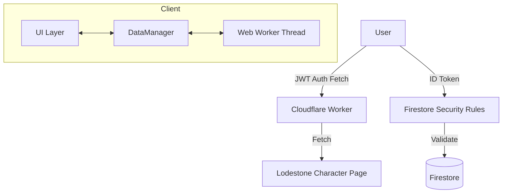

# The Hunt System Specification

本ドキュメントは、FFXIVモブハント管理アプリケーション「The Hunt」の完全な技術仕様書である。
本仕様書を参照することで、開発者はシステムを一から再構築し、現在の堅牢なセキュリティモデルと高度な最適化を維持することが可能となる。

---

## 1. システム概要とアーキテクチャ

### 1.1 目的

FFXIVのS/A/Fランクモブの湧き時間をリアルタイムで管理・共有し、高度な湧き予測計算を提供する、信頼性の高い共有プラットフォーム。

### 1.2 技術スタック

- **Frontend**: HTML5, Vanilla JavaScript (ESM), Web Workers
- **Styling**: Vanilla CSS, Tailwind CSS utilities
- **Backend**: Firebase (Firestore, Authentication)
- **Proxy**: Cloudflare Workers (Secure JWT Proxy)
- **Asset/Data**: JSON, WebP

### 1.3 アーキテクチャ概略



---

## 2. データ構造詳細

### 2.1 静的データ (`mob_data.json`)

- アプリ構築の基盤となるモブの基本定義（ランク、名前、エリア、リリポップ時間、湧き条件パラメータ等）。
- `loadBaseMobData()` を通じて非同期で読み込まれ、`localStorage` にキャッシュされる。

### 2.2 状態管理 (`dataManager.js`)

#### 2.2.1 Global State (`state`)

```javascript
{
    userId: String, // Firebase UID
    lodestoneId: String, // 連携済みLodestone ID
    characterName: String,
    isVerified: Boolean, // Firestore 'users' ドキュメントの存在確認
    baseMobData: Array, // JSONからの静的定義
    mobs: Array, // 動的状態（静的定義 + 討伐時間 + 湧き予測結果）の統合配列
    maintenance: Object, // サーバーメンテナンス情報
    initialLoadComplete: Boolean, // 初期化完了フラグ
    
    // 並列読み込み用バッファ
    pendingStatusMap: Object,
    pendingMaintenanceData: Object,
    pendingLocationsMap: Object,
    pendingMemoData: Object
}
```

---

## 3. Firestore データベース設計

### 3.1 コレクション構成

| Collection | Document ID | Description |
| --- | --- | --- |
| `mob_status` | `s_latest`, `a_latest`, `f_latest` | 討伐情報（ランク別1ドキュメント集約） |
| `users` | `{FirebaseUID}` | 認証済みユーザー情報（Lodestone ID連携） |
| `shared_data` | `memo`, `maintenance` | 共有メモ、メンテ情報 |
| `mob_locations` | `{MobID}` | 湧き潰しポイント情報 |

### 3.2 セキュリティルール (Security Rules)

**原則**: 未認証（またはLodestone未連携）のユーザーは Read のみ許可。Write (討伐報告/メモ/湧き潰し) は `users/{uid}` に `lodestone_id` が存在する正規ユーザーのみに限定。

---

## 4. 初期化と高速化ロジック

### 4.1 並列読み込みアーキテクチャ

ロード時間を最小化するため、以下の処理を完全に並列で実行する。

1. **基本データの読み込み** (`loadBaseMobData`): `mob_data.json` のフェッチとキャッシュ適用。
2. **認証と購読の開始** (`initializeAuth` → `startRealtime`): Firebase認証の実行後、Firestoreのリアルタイム購読を即座に開始。

### 4.2 データの整合性維持（バッファリング）

並列実行により、JSONデータの展開前にFirestoreから最新データが届く可能性がある。この場合：

- `dataManager.js` 内の `pending` バッファにデータを一時保存する。
- JSONデータの展開完了後、`applyPendingRealtimeData()` を呼び出してバッファデータを一括適用し、モブの再湧き予測を再計算する。
- すべての必須データ（基本データ、最新ステータス、メンテ情報）が統合されるまでローディング画面を維持し、不完全なデータに基づく誤操作を防止する。

---

## 5. 認証・セキュリティアーキテクチャ

### 5.1 Lodestone キャラクター認証フロー

1. **UID発行**: Firebase Anonymous Authentication により一時的なUIDを取得。
2. **検証コード**: クライアントでランダムな `HUNT-XXXX` コードを生成。
3. **Lodestone反映**: ユーザーがキャラプロフィールの「自己紹介」にコードを貼付。
4. **Proxy検証**:
   - クライアントが Firebase ID Token を取得し、Cloudflare Worker へ送信。
   - Worker が JWT (RS256) を署名検証し、正規ユーザーであることを確認。
   - Worker が Lodestone を取得し、自己紹介文内のコードを確認。
5. **永続化**: 検証成功後、Firestore の `users/{uid}` に情報を書き込む。

---

## 6. アルゴリズム・計算仕様

### 6.1 リリポップ計算 (`cal.js`)

- 討伐時間からの経過秒数に基づき算出。
- メンテ明け（サーバー起動時刻）が前回の討伐時刻より新しい場合、リリポップ時間を通常比 60% に短縮。

### 6.2 湧き条件予測 (Web Worker)

- 月齢、天候、ET時間の3条件を Web Worker (別スレッド) で総当たり探索。
- メインスレッドのレスポンスを妨げずに高度な予測値を算出。

---

## 7. 開発・運用指針

1. **セキュリティ優先**: Firestore ルールと Worker の JWT 検証をバイパスする実装は厳禁。
2. **クリーンコード**: 冗長な日本語コメントやログは残さず、コード自体を説明的に保つ。
3. **SSoT (Single Source of Truth)**: 状態管理は `dataManager.js` に集約し、UI更新は `CustomEvent` で検知する。
4. **リアルタイム性の追求**: データ統合が完了した瞬間、即座にUIへ反映させ、ユーザー待機時間を最小化する。

---
Last Updated: 2026-02-06
