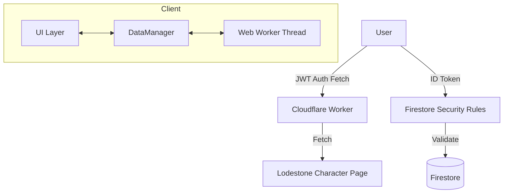

# The Hunt System Specification

本ドキュメントは、FFXIVモブハント管理アプリケーション「The Hunt」の完全な技術仕様書である。
本仕様書を参照することで、開発者はシステムを一から再構築し、現在の堅牢なセキュリティモデルを維持することが可能となる。

---

## 1. システム概要とアーキテクチャ

### 1.1 目的

FFXIVのS/A/Fランクモブの湧き時間をリアルタイムで管理・共有し、高度な湧き予測計算を提供する、信頼性の高い共有プラットフォーム。

### 1.2 技術スタック

- **Frontend**: HTML5, Vanilla JavaScript (ESM), Web Workers
- **Styling**: Vanilla CSS, Tailwind CSS utilities
- **Backend**: Firebase (Firestore, Authentication)
- **Proxy**: Cloudflare Workers (Secure JWT Proxy)
- **Asset/Data**: JSON, WebP

### 1.3 アーキテクチャ概略



---

## 2. データ構造詳細

### 2.1 静的データ (`mob_data.json`)

(2.1節の基本スキーマは維持。詳細は静的ファイルを参照)

### 2.2 状態管理 (`dataManager.js`)

#### 2.2.1 Global State (`state`)

```javascript
{
    userId: localStorage.getItem("user_uuid"), // Firebase UID
    lodestoneId: localStorage.getItem("lodestone_id"), // 連携済みLodestone ID
    characterName: localStorage.getItem("character_name"),
    isVerified: Boolean, // Firestore上の'users'ドキュメント存在確認
    // ...その他の描画用プロパティ
}
```

---

## 3. Firestore データベース設計

### 3.1 コレクション構成

| Collection | Document ID | Description |
| --- | --- | --- |
| `mob_status` | `s_latest`, `a_latest`, `f_latest` | 討伐情報（ランク別1ドキュメント集約） |
| `users` | `{FirebaseUID}` | 認証済みユーザー情報（Lodestone ID連携） |
| `shared_data` | `memo`, `maintenance` | 共有メモ、メンテ情報 |
| `mob_locations` | `{MobID}` | 湧き潰しポイント情報 |

### 3.2 セキュリティルール (Security Rules)

**原則**: 未認証（またはLodestone未連携）のユーザーは Read のみ許可。Write (討伐報告/メモ/湧き潰し) は `users/{uid}` に `lodestone_id` が存在する正規ユーザーのみに限定。

---

## 4. 認証・セキュリティアーキテクチャ

本システムの最大の特徴である、偽装不可能な認証フロー。

### 4.1 Lodestone キャラクター認証フロー

1. **UID発行**: Firebase Anonymous Authentication により一時的なUIDを取得。
2. **検証コード**: クライアントでランダムな `HUNT-XXXX` コードを生成。
3. **Lodestone反映**: ユーザーがキャラプロフィールの「自己紹介」にコードを貼付。
4. **Proxy検証**:
   - クライアントが Firebase ID Token を取得。
   - Cloudflare Worker へのリクエストに `Authorization: Bearer <ID_TOKEN>` を含める。
   - Worker が Google 公開鍵で JWT (RS256) を署名検証し、正規ユーザーであることを確認。
   - Worker が Lodestone を取得し、自己紹介文内のコードを確認。
5. **永続化**: 検証成功後、Firestore の `users/{uid}` に Lodestone ID を書き込む。

### 4.2 Cloudflare Worker (検証プロキシ)

- **役割**: Lodestone の CORS 回避および認証ゲートウェイ。
- **セキュリティ**:
  - `lodestoneId` パラメータのみを受け取り、URLは内部で `https://jp.finalfantasyxiv.com/...` と固定構築。
  - Firebase ID Token の `aud` (Audience), `iss` (Issuer), `exp` (Expiry) を厳密にチェック。
  - プロキシを汎用目的で使用することを完全に遮断。

---

## 5. アルゴリズム仕様

### 5.1 リリポップ計算 (`cal.js`)

- 詳細は `4.1` 節参照。メンテ明け `* 0.6` 短縮ロジック（S/Aのみ）を含む。

### 5.2 湧き条件予測

- 月齢、天候、ET時間の3条件を Web Worker で総当たり探索し、15分前の事前通知 (`🔜`) を行う。

---

## 6. UI/UX 実装仕様

### 6.1 レンダリング最適化

- `onSnapshot` による差分更新。
- カラム配置 (`grid-cols-1/2/3`) は `ResizeObserver` により動的に管理。

### 6.2 モバイル体験

- 誤タップ防止のため、マップ上の湧き潰しチェックは「ダブルタップ（300ms以内）」でトリガー。

---

## 7. 開発・運用指針

今後、本プロジェクトに携わる際の鉄則：

1. **セキュリティ優先**: Firestore ルールと Worker の JWT 検証をバイパスするような実装は厳禁。
2. **クリーンコード**:
   - 冗長な日本語コメントやデバッグログを本番コードに残さない。
   - JSDoc 以外は、コードそのものが説明的であるように保つ。
3. **日本語ドキュメント**: ユーザーおよび開発者向けドキュメント（README/Specification）は常に最新の日本語で維持する。
4. **リアルタイム性**: 状態の不整合を防ぐため、常に `dataManager.js` を唯一の真実のソース (Single Source of Truth) とし、UI は `CustomEvent` を介して更新を検知する。

---
Last Updated: 2026-02-02
