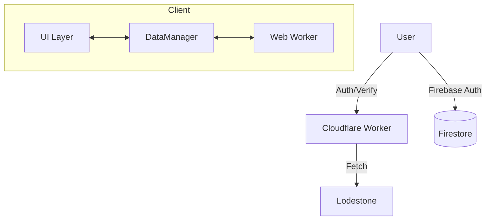

# The Hunt System Specification

本ドキュメントは、FFXIVモブハント管理アプリケーション「The Hunt」の完全な技術仕様書である。
本仕様書の目的は、開発者がシステム構造、アルゴリズム、およびUI/UXの挙動を正確に把握し、一貫性を保ったメンテナンスや機能拡張を可能にすることである。

---

## 1. システム概要とアーキテクチャ

### 1. 技术スタック

- **Frontend**: HTML5, Vanilla JavaScript (ESM), Web Workers
- **Styling**: Vanilla CSS, Tailwind CSS utilities
- **Backend**: Firebase (Firestore, Authentication)
- **Proxy**: Cloudflare Worker (Lodestone認証プロキシ)

### 1.2 アーキテクチャ概略

```mermaid
graph TD
    User[User] -->|Auth/Verify| Worker[Cloudflare Worker]
    Worker -->|Fetch| Lodestone[Lodestone]
    
    User -->|Firebase Auth| DB[(Firestore)]
    
    subgraph Client
        UI[UI Layer] <--> DM[DataManager]
        DM <--> WorkerThread[Web Worker]
    end
```

---

## 2. データ構造と状態管理

### 2.1 状態管理 (`dataManager.js`)

システムの状態（`state`）は、静的データ（`mob_data.json`）とFirestoreからのリアルタイムデータを統合した `mobs` 配列を中心に管理される。

- **pendingバッファ**: Firestoreからデータが届いた際、基本データ（JSON）の読み込みが完了していない場合は一時的にバッファに保持し、統合を待つ。
- **計算結果の統合**: 湧き予測やリリポップ計算の結果は `repopInfo` オブジェクトとして各モブデータに付加される。

---

## 3. Firestore データベース設計

| Collection | Description |
| --- | --- |
| `mob_status` | 討伐日時、報告プレイヤーUID等の最新情報 |
| `users` | 認証済みユーザー情報（Lodestone ID、検証済みフラグ） |
| `shared_data` | 共有メモ（memo）、メンテナンス情報（maintenance） |
| `mob_locations` | 各モブの湧き潰しポイント（1/0の状態） |

---

## 4. 認証・セキュリティ

### 4.1 Lodestone キャラクター認証

1. **検証コードの生成**: 8文字のランダムな文字列（`HUNT-XXXXXXXX` / base36）を生成。
2. **Lodestone連携**: ユーザーがキャラプロフィールの自己紹介欄にコードを記載。
3. **プロキシ検証**: Cloudflare Worker経由でLodestoneをスクレイピングし、コードの一致を確認。
4. **権限付与**: 検証成功後、Firestoreの `users` コレクションにUIDとLodestoneIDを紐付け。これにより書き込み権限が解放される。

---

## 5. アルゴリズム・計算仕様

### 5.1 リリポップ計算 (`cal.js`)

- **基本ロジック**: `REPOP_s` (最短) と `MAX_s` (最長) の秒数に基づく。
- **メンテナンス補正**:
  - サーバー起動時刻（メンテナンス終了）が前回の討伐時刻より新しい場合、リリポップ時間を **通常比 60%** に短縮する。
  - **例外**: Fランクモブは短縮の対象外（常に100%計算）。

### 5.2 湧き条件予測 (Web Worker)

- 月齢、天候、ET時間の3条件をWeb Worker内で総当たり探索し、計算をメインスレッドから切り離す。
- `findNextSpawn` 関数により、次に条件を満たす「開始時刻」と「終了時刻」を算出。

### 5.3 通知ロジック (`notificationManager.js`)

- **タイミング**: 湧き条件開始の **2分前** および **開始時** の合計2回。
- **重複防止**: `notifiedCycles` (Set) でモブIDと湧きサイクルを管理。

---

## 6. ソートと表示形式

### 6.1 ソートアルゴリズム (`mobSorter.js`)

以下のステータスグループ優先度に従い、リストを整列させる。

1. **セクション順**: `MaxOver` > `PopWindow / ConditionActive` > `Respawning (Next)` > `Maintenance`
2. **MaxOverグループ内**:
   - `isInConditionWindow` (条件成立中) を最優先。
   - `Rank`: S > F > A の順。
   - `ExpansionId`: 降順 (新しい拡張を優先)。
3. **通常（Window/Next）グループ内**:
   - `ConditionActive` を最優先。
   - `elapsedPercent`: 降順 (%が高いものを上へ)。
   - `minRepop`: 昇順 (近いものを上へ)。
   - `Rank`: S > A > F の順。

### 6.2 モブリスト形式とレイアウト (`uiRender.js`)

- **グループ化表示**: 各ステータスセクションは `status-group-separator` で区切られ、ユーザーが現在のフェーズを直感的に把握できるよう設計されている。
- **マルチカラム (PC)**: 画面幅 1024px 以上では `lg:grid-cols-3` を使用し、3列のグリッド形式でカードを表示。
- **コンパクトリスト (`pc-list-item`)**: サイドバー等に使用される、1行に情報を凝縮したリスト形式。

---

## 7. UI・視覚効果の仕様

### 7.1 プログレスバーとカードの演出 (`uiRender.js`)

- **グラデーション**: 100%未満は水色から青へのグラデーション。
- **白い発光 (`BLINK_WHITE`)**: 進行度 90% 超過時、または MaxOver かつ条件成立時に適用。
- **白い太枠 (`blink-border-white`)**: 湧き条件（天候・時間等）が現在成立している場合に適用される「実行可能」サイン。
- **グレーアウト**: 倒した直後の猶予期間(`Next`)やメンテナンス中は、カードの彩度を落として表示。

### 7.2 アイコン・表示ラベル

- `⏳`: Pop Window / 湧き時間内
- `🔜`: Respawning / 次回湧きまで
- `🚨`: Max Over / 最長時間を超過
- `🛠️`: Maintenance / メンテナンス中

---

## 8. 開発・運用指針

1. **SSoT**: 状態は `DataManager` に集約し、UI反映は CustomEvent 経由で行う。
2. **パフォーマンス**: 描画は `IntersectionObserver` で可視範囲のみに制限し、DOMの肥大化を防ぐ。
3. **セキュリティ**: Lodestone認証をバイパスした書き込みはFirestoreルールで厳格に遮断する。

---
Last Updated: 2026-03-23
